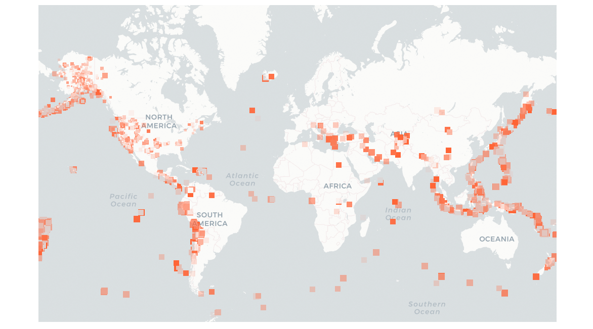

# Earthquake Points

Draw quake points on a map.

<p align="center">
  
</p>

## Serving Quake Feeds

Feeds are loaded into Go structs from a csv file inside the `feed` folder. The Go server can be run from the root folder.

```sh
go run main.go
```

## Serving Map

A simple Leaflet map is provided to display a base map with the quake feeds in a separate layer.

```sh
cd public
python3 -m http.server
```

Then visit [http://localhost:8000/](http://localhost:8000/) in your browser!

## TODO

- [ ] Load dynamic feeds from https://earthquake.usgs.gov/earthquakes/feed/v1.0/csv.php
- [ ] Implement zoom options
